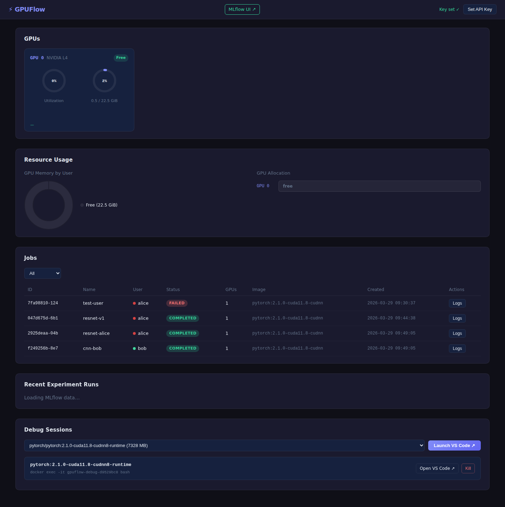
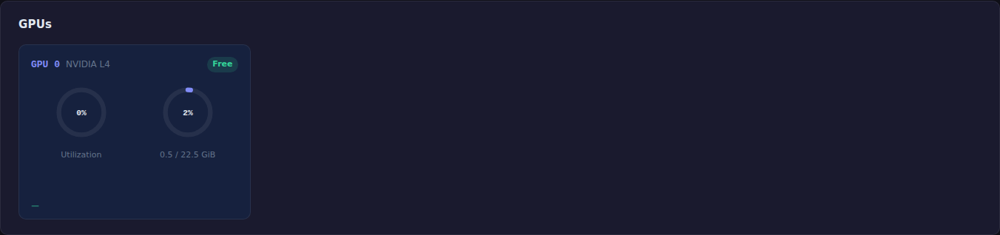
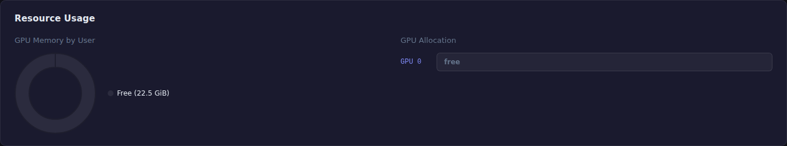
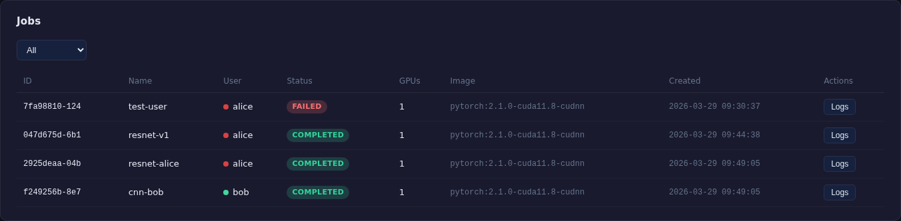
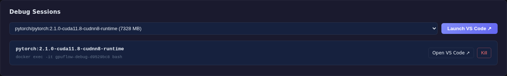

<div align="center">

# ⚡ GPUFlow

**Simple GPU scheduling and distributed training for ML teams**

[](https://python.org)
[](https://fastapi.tiangolo.com)
[](https://pytorch.org)
[](https://docker.com)
[](LICENSE)

> No Kubernetes. No Slurm. Just submit your training script and go.

</div>

---

## The Problem

ML teams waste hours fighting GPU schedulers:

```
❌  "Is GPU 3 free right now?"
❌  SSH to the server, run nvidia-smi, realize it's busy
❌  NCCL crashes on multi-GPU runs — nobody knows why
❌  Two jobs accidentally share GPU memory and OOM each other
```

GPUFlow fixes this with a single CLI command.

---

## How It Works

```
┌─────────────────────────────────────────────────────────────────┐
│                                                                 │
│   $ gpuflow run train.py --gpus 2 --name resnet-exp            │
│                                                                 │
└────────────────────────┬────────────────────────────────────────┘
                         │  HTTP POST /jobs
                         ▼
┌─────────────────────────────────────────────────────────────────┐
│                      API Server (FastAPI)                       │
│                                                                 │
│   POST /jobs   GET /jobs   GET /jobs/{id}   GET /gpus          │
└────────────────────────┬────────────────────────────────────────┘
                         │
                         ▼
┌─────────────────────────────────────────────────────────────────┐
│                    Scheduler (FIFO Queue)                       │
│                                                                 │
│   ┌──────────┐   ┌──────────┐   ┌──────────┐                  │
│   │ QUEUED   │──▶│ RUNNING  │──▶│COMPLETED │                  │
│   └──────────┘   └──────────┘   └──────────┘                  │
│                                                                 │
│   Polls GPU availability every 2s via nvidia-smi               │
└────────────────────────┬────────────────────────────────────────┘
                         │  assigns GPU indices
                         ▼
┌─────────────────────────────────────────────────────────────────┐
│                    Docker Runner                                │
│                                                                 │
│   docker run --gpus device=0,1 \                               │
│     -v $PWD:/workspace \                                        │
│     -e CUDA_VISIBLE_DEVICES=0,1 \                              │
│     pytorch/pytorch:2.1.0 \                                    │
│     torchrun --nproc_per_node=2 train.py                       │
│                                                                 │
└─────────────────────────────────────────────────────────────────┘
```

---

## Job Lifecycle

```
  Submit          Schedule         Execute          Done
    │                │                │               │
    ▼                ▼                ▼               ▼
 [QUEUED] ──────▶ [RUNNING] ──────▶ [COMPLETED]
                                  ╲
                                   ╲──▶ [FAILED]
                              (cancel)
                                 ╲──▶ [CANCELLED]
```

---

## Quick Start

```bash
# 1. Clone and install
git clone https://github.com/ajayrafa25/gpuflow
cd gpuflow
./install.sh          # sets up .env, builds Docker, starts server

# 2. Install CLI
pip install -e .

# 3. Submit a job
gpuflow run train.py --gpus 1 --name my-experiment

# 4. Check status
gpuflow status

# 5. Stream logs
gpuflow logs <job-id>
```

---

## CLI Reference

```
gpuflow run <script.py> [OPTIONS]

  --gpus     INT    Number of GPUs to allocate      [default: 1]
  --nodes    INT    Number of nodes (multi-node)    [default: 1]
  --name     TEXT   Job name
  --image    TEXT   Docker image override
  --command  TEXT   Override launch command
  --user     TEXT   Your username (shown in dashboard resource panel)

gpuflow status              # list all jobs (shows User column)
gpuflow logs <job_id>       # tail logs
gpuflow cancel <job_id>     # cancel queued/running job
```

### Examples

```bash
# Single-GPU training
gpuflow run train.py --gpus 1 --name baseline

# Multi-GPU with torchrun (auto-configured)
gpuflow run train.py --gpus 4 --name ddp-run

# Custom Docker image
gpuflow run train.py --gpus 2 --image myrepo/mytorch:latest

# Override command entirely
gpuflow run train.py \
  --command "pip install timm && python train.py --lr 0.001" \
  --gpus 1
```

---

## Multi-GPU Training

GPUFlow auto-configures `torchrun` for multi-GPU jobs:

```bash
# You submit:
gpuflow run train.py --gpus 4 --name ddp-exp

# GPUFlow runs:
torchrun --nproc_per_node=4 train.py
# with CUDA_VISIBLE_DEVICES=0,1,2,3 set automatically
```

For multi-node, environment variables are injected automatically:

```
MASTER_ADDR, MASTER_PORT, WORLD_SIZE, RANK
```

---

## GPU Scheduling Logic

```python
# Every 2 seconds the scheduler does:

free_gpus = all_gpus - gpus_in_use_by_running_jobs

for job in queue(status=QUEUED):
    if len(free_gpus) >= job.requested_gpus:
        assigned = free_gpus[:job.requested_gpus]
        launch_job(job, gpus=assigned)
        break   # one job at a time per scheduling tick
```

No preemption. No priorities. Pure FIFO — predictable and simple.

---

## REST API

| Method | Endpoint | Description |
|--------|----------|-------------|
| `POST` | `/api/v1/jobs` | Submit a job |
| `GET` | `/api/v1/jobs` | List all jobs |
| `GET` | `/api/v1/jobs/{id}` | Get job details |
| `DELETE` | `/api/v1/jobs/{id}` | Cancel a job |
| `GET` | `/api/v1/jobs/{id}/logs` | Stream logs |
| `GET` | `/api/v1/gpus` | List GPUs + utilization |
| `GET` | `/api/v1/mlflow/experiments` | List MLflow experiments |
| `GET` | `/api/v1/mlflow/runs` | List recent MLflow runs |
| `GET` | `/api/v1/debug/images` | List available Docker images |
| `POST` | `/api/v1/debug/sessions` | Launch a debug container |
| `GET` | `/api/v1/debug/sessions` | List active debug sessions |
| `DELETE` | `/api/v1/debug/sessions/{id}` | Kill a debug session |

**Submit a job:**
```bash
curl -X POST http://localhost:8000/api/v1/jobs \
  -H "X-API-Key: <your-key>" \
  -H "Content-Type: application/json" \
  -d '{
    "name": "resnet-cifar10",
    "entrypoint": "train.py",
    "requested_gpus": 1,
    "docker_image": "pytorch/pytorch:2.1.0-cuda11.8-cudnn8-runtime"
  }'
```

**Response:**
```json
{
  "id": "c911ae69-2d34-47eb-8bd7-588d40f08277",
  "name": "resnet-cifar10",
  "status": "queued",
  "requested_gpus": 1,
  "assigned_gpus": [],
  "created_at": "2026-03-28T19:44:13Z"
}
```

---

## Architecture

```
gpuflow/
├── api/
│   ├── main.py          # FastAPI app + lifespan (scheduler, MLflow, sessions)
│   ├── auth.py          # API key middleware
│   ├── schemas.py       # Request/response models
│   └── routes/
│       ├── jobs.py      # Job CRUD + log streaming
│       ├── gpus.py      # GPU inspection endpoint
│       ├── mlflow.py    # MLflow proxy (experiments, runs)
│       └── debug.py     # Debug session management
├── scheduler/
│   └── scheduler.py     # Async FIFO scheduler loop
├── worker/
│   └── worker.py        # Job executor (calls runner)
├── runner/
│   └── docker_runner.py # Docker container lifecycle + MLflow URI injection
├── gpu/
│   └── inspector.py     # nvidia-smi / pynvml wrapper
├── db/
│   └── store.py         # aiosqlite job store
├── models/
│   └── job.py           # Job dataclass + status enum
├── debug/
│   └── session_manager.py # Docker-based interactive debug sessions
├── mlflow_server.py     # MLflow tracking server subprocess manager
├── cli/
│   └── main.py          # Click CLI (--user flag, User column in status)
├── config.py            # Pydantic settings (.env)
└── dashboard/
    ├── index.html       # Single-page app shell
    ├── app.js           # Chart.js gauges, sparklines, resource panel
    └── style.css        # Dark theme styles
```

---

## Dashboard

GPUFlow ships with a full-featured web dashboard at `http://localhost:8000/dashboard`:



### GPU Utilization — real-time SVG gauges + sparklines



### Resource Usage — who's occupying what



### Jobs Table — live queue with user tracking



### MLflow — embedded experiment tracking


### Interactive Debug Sessions



---

## v1 Scope

| Feature | Status |
|---------|--------|
| Job submission + queue | ✅ |
| GPU-aware scheduling (FIFO) | ✅ |
| Docker-based execution | ✅ |
| Multi-GPU (`torchrun`) | ✅ |
| Log streaming | ✅ |
| REST API | ✅ |
| Web dashboard | ✅ |
| API key auth | ✅ |
| Multi-node training | ✅ |
| MLflow auto-start + dashboard | ✅ |
| GPU utilization gauges + sparklines | ✅ |
| User resource occupancy panel | ✅ |
| Interactive debug sessions (Docker + VS Code) | ✅ |
| Priority scheduling | 🔜 v2 |
| Kubernetes backend | 🔜 v3 |

---

## Configuration

All settings via `.env`:

```env
API_KEY=your-secret-key
API_HOST=0.0.0.0
API_PORT=8000
DB_PATH=/tmp/gpuflow.db
LOG_DIR=/tmp/gpuflow_logs
DEFAULT_DOCKER_IMAGE=pytorch/pytorch:2.1.0-cuda11.8-cudnn8-runtime
SCHEDULER_POLL_INTERVAL=2.0
```

---

<div align="center">

Built for ML engineers who just want to run experiments.

</div>
